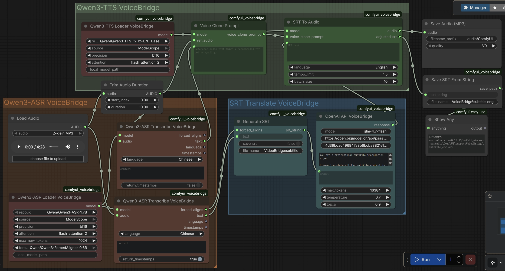

# ComfyUI-VoiceBridge

ComfyUI-VoiceBridge is a powerful ComfyUI custom node that translates spoken audio from any language to a target language while preserving the original speaker's voice characteristics, and generates bilingual SRT subtitle files. 

---
This node integrates ASR (Automatic Speech Recognition), LLM (Large Language Model), and TTS (Text-to-Speech) technologies to provide a complete speech translation pipeline.



# Features

- **Speech Translation:** Convert speech from one language to any other language while retaining the original speaker's voice timbre


- **Multi-Language Support:** Support for speech recognition and translation in dozens of languages covering major global languages

- **Automatic voice alignment:** The generated translated voice is automatically aligned with the original voice to ensure the synchronization between the translated voice and the video content.

- **Accurate subtitle generation:** Through force align technology, accurate subtitles can be generated, ensuring that the subtitles and voice are synchronized at the millisecond level.


## Installation

### Via ComfyUI Manager (Recommended)
Search for "VoiceBridge" in ComfyUI Manager

### Manual Installation
```bash
cd ComfyUI/custom_nodes
git clone https://github.com/YanTianlong-01/comfyui_voicebridge.git
cd comfyui_voicebridge
pip install -r requirements.txt
```


